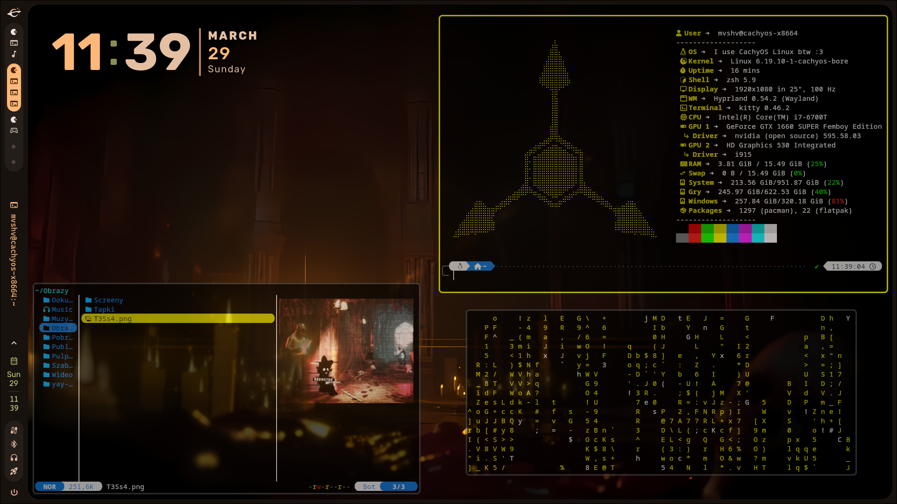

# 🌌 Murder Drones Theme Hyprland 
## By Mvshv
### It’s my first dots, hope you’ll like it :)

---

## 👀 Preview

---

## 🤔 What is it?
Hyprland theme inspired by the indie series **"Murder Drones"**, made by **Glitch Productions**. 

## 🛠️ What do you need?
* **OS:** CachyOS (recommended), but works on all distros (might need path/command tweaks).
* **WM:** Hyprland 
* **Shell:** Zsh 

## 📦 Apps you need:
* **[Caelestia shell](https://github.com/Caelestia-OS/caelestia-shell)** - side bar, app drawer, and dashboard panel.
* **Yazi** - terminal file manager (available in pacman, dnf, etc.).
* **Cmatrix** - for the "hacker" vibe.
* **Kitty** - recommended terminal.
* **Vivaldi** - default browser in my config (change in `hyprland.conf`).

> [!TIP]
> If you copied my `zshrc`, you can just type `hyprconf` in the terminal to open the config!

---

# ⚠️ Important! 
## Check everything before copying!

This theme was made specifically for **my setup**. Your hardware/monitor/paths can be different. Check the files if you don’t want to end up with config errors or a black screen.

### 💡 My advice:
If you want my `zshrc`, **don’t copy the whole file**. Instead, copy only the stuff under:
`--- GO AHEAD RÓB CO CHCESZ ---`
Everything above is system-specific and might break your shell on other distros!

## 📦 So how to install it?
### Just clone the repository
`git clone https://github.com/mvshv010110/MurderDrones-Hyprland.git`
`cd MurderDrones-Hyprland`
